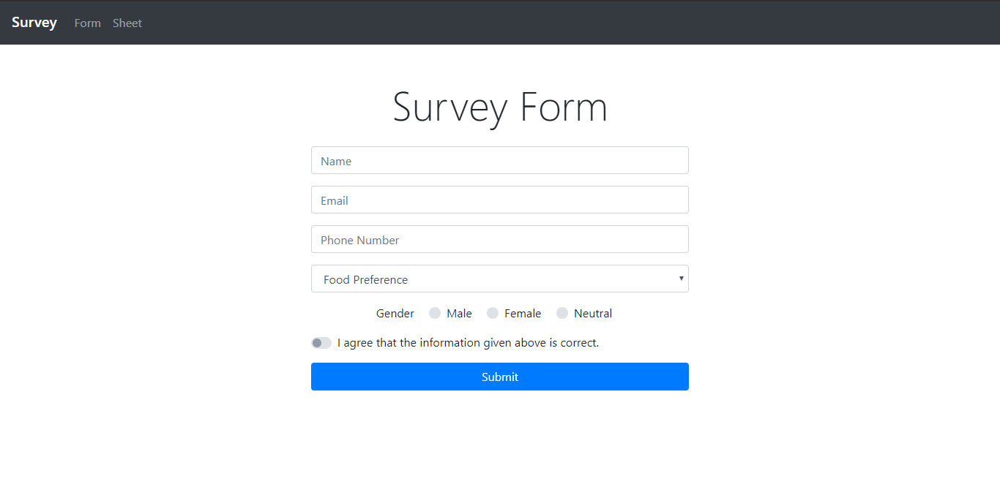
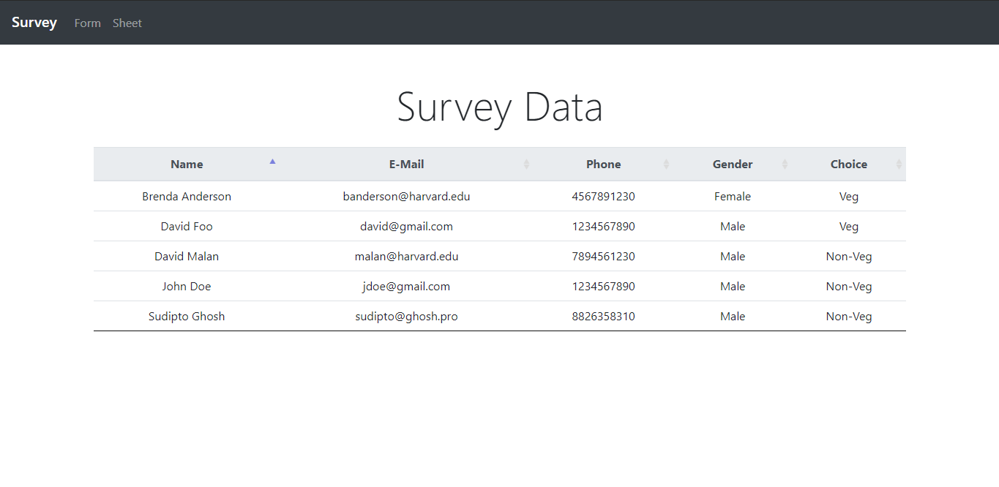
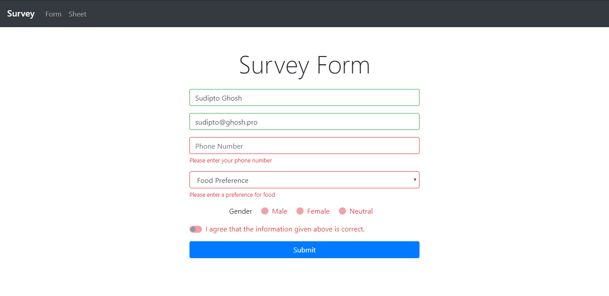
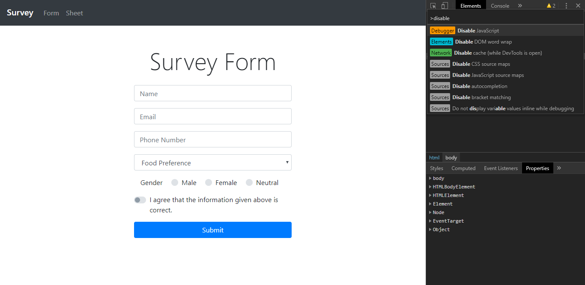
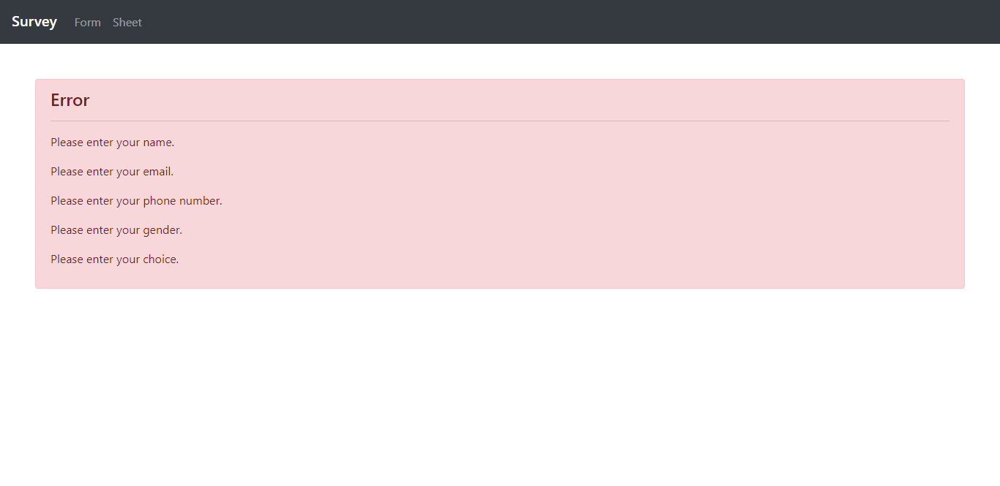

# Survey Form App with Flask

This web application presents an user interface created using Bootstrap 4 to the user and expects user inputs. It also has a route that uses DataTables  wherein the user can view all form submissions.

If the user has not filled out all of the required fields, client-side JavaScript handles form validation.

Even in the case that an user disables JavaScript using Developer Tools, the server-side validation logic takes care of that.

